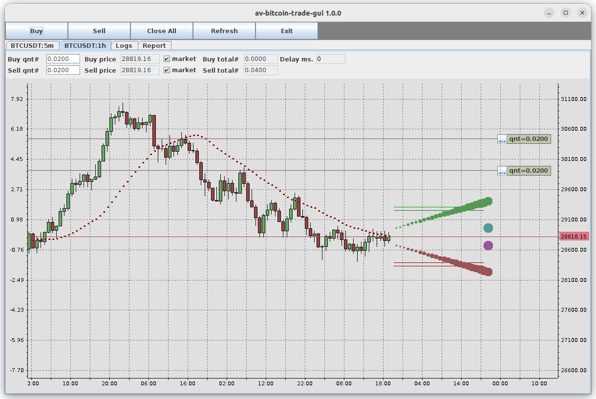

# av-crypto-predictor

### How to start
- Configure app_config.py (trade_advice_pub = "tcp://localhost:4505" 
  should be the same for av-crypto-predictor and av-crypto-trade-gui)
- Run av-crypto-emulator.sh (Random quote emulator https://github.com/andreyvel/av-crypto-trade)
- Run av-crypto-trade-gui.sh (Linux GUI client for trading https://github.com/andreyvel/av-crypto-trade)
- Run dummy_predictor.py
  
 
Result of dummy prediction: 

Components and data flow: 

